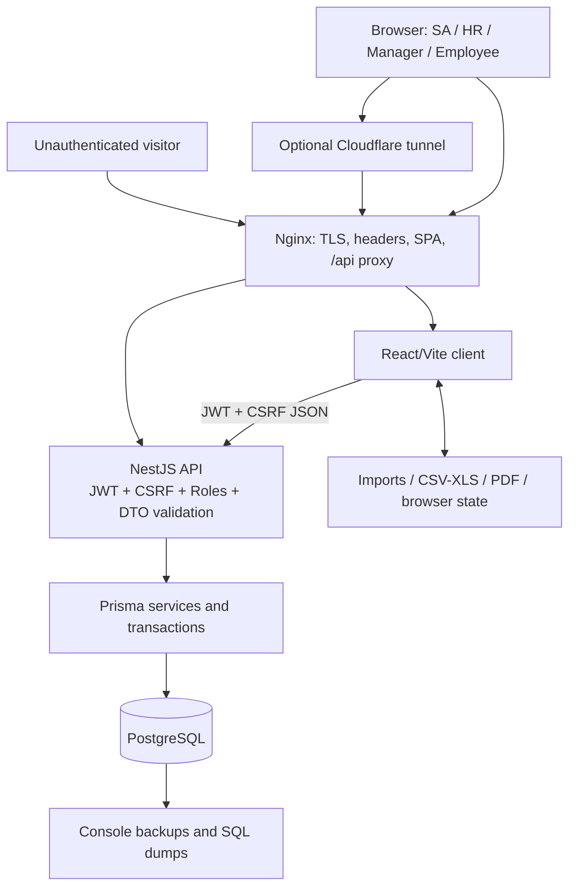

# HR ERP Full-Stack Production-Readiness Audit

**Audit date:** 2026-07-13

**Repository:** `CarDinN-dev/hr-new`

**Revision:** `2e833d0aeff3797341e609c6993aa2b16b284450`

**Decision:** **BLOCK production release**

> **Evidence status:** This preliminary report reconciles four independent repository-wide reviews. Each completed reviewer consumed and closed the same 147-file authoritative worklist, producing 588 review receipts and 61 pre-reconciliation candidates. Overlapping candidates were reduced here to 18 root-cause findings. Two reviewers were stopped before completion at the user's request; centralized validation and attack-path phases were not completed. Static findings with deployment or policy dependencies are explicitly marked for runtime confirmation. No application implementation code, migration, infrastructure, or dependency was changed during this audit.

## Architecture summary

The application is a React/Vite single-page HR console served by Nginx. Nginx proxies `/api/v1` to a NestJS API. NestJS applies global JWT authentication, CSRF, and role guards, validates DTOs, and uses Prisma to access PostgreSQL. Docker Compose binds PostgreSQL, API, HTTP, and HTTPS ports to loopback; an optional Cloudflare tunnel can expose the frontend/API. The browser stores bearer/CSRF tokens in session storage, imports/exports HR spreadsheets and PDFs, and persists a broad console-state document through privileged API endpoints.

Primary trust boundaries are unauthenticated-to-authenticated session creation; authenticated role-to-object scope; browser-to-API authoritative state; API-to-database transactions; imports/exports-to-operator applications; reverse-proxy identity; and database-to-backup/sync storage. Detailed assets, actors, invariants, and abuse cases are in `THREAT_MODEL.md`.

## Scope and method

The audit inventoried 184 tracked files and reviewed the 147-file authoritative application/deployment worklist, covering frontend source/tests/build config, backend controllers/services/DTOs/guards, Prisma schema/migrations/seed, Dockerfiles/Compose, Nginx, Cloudflare scripts, backup handling, and documentation. Review traced login/session, role/object authorization, employee/document access, attendance/leave/payroll, payroll exports, production bootstrap, backups/rollback, and browser state/API synchronization.

The reviewers found no plausible request-reachable command execution, raw SQL injection, backend SSRF, archive extraction, arbitrary server filesystem write, XML/unsafe deserialization, or server-template sink. These are negative findings, not guarantees against future code changes.

## Safe baseline checks

| Command | Result |
| --- | --- |
| `git status --short` and `git rev-parse HEAD` | Clean before audit documents; target revision confirmed. |
| `docker compose config --quiet` | Pass. |
| `npm.cmd run test` | Pass: 7 test files, 19 tests. |
| `npm.cmd run build` | Pass; Vite warns that `LoginScene-CJmgE3u8.js` is 527.60 kB minified. |
| `backend: npm.cmd run prisma:generate` | Pass. |
| `backend: npm.cmd run build` | Pass. |
| `backend: npm.cmd run test:security` | Pass; the script intentionally logs an internal error marker while testing error filtering. |
| `backend: npx.cmd eslint "{src,prisma}/**/*.ts"` | Pass, no output. The repository lint script was not used because it includes `--fix`. |
| Root/backend `npm.cmd audit --omit=dev --audit-level=high` | Pass: zero reported production dependency vulnerabilities. |

Docker images/services, migrations against a database, backup restore, four-role API E2E, concurrent PostgreSQL tests, proxy-topology tests, browser E2E, and accessibility tests were not run. The persistent database volume was not proven disposable, so `docker compose up` was intentionally not executed.

## Findings summary

| ID | Severity | Confidence | Finding | Verification state |
| --- | --- | --- | --- | --- |
| FS-001 | Medium | High technical / unknown data authenticity | Sensitive-looking HR/payroll fixtures are in the public frontend bundle | Build/string proof; confirm whether data is real |
| FS-002 | High | High | Production restart re-seeds/reactivates privileged accounts without session revocation | Static startup/upsert proof; disposable restart test pending |
| FS-003 | High | High | Client-controlled leave duration can undercharge leave and payroll | Complete static data-flow proof |
| FS-004 | High | High | Concurrent leave creation overcommits balances | Runtime harness reproduced |
| FS-005 | High | High | Concurrent leave updates corrupt pending balance accounting | Repeated static interleaving proof; DB test pending |
| FS-006 | High | High | Concurrent leave decisions double-apply balance changes | Runtime harness reproduced double approval |
| FS-007 | High | High | Concurrent cancellation/decision races can underflow or diverge balances | Repeated static interleaving proof; DB test pending |
| FS-008 | High | High | Announcement reads omit department authorization | Repeated list/detail source-to-query proof |
| FS-009 | Medium | Medium | Managers can target/retarget announcements outside intended scope | Static proof; intended publication policy confirmation required |
| FS-010 | High | High | Manager can take over an HR-authored performance review | Complete static object-authorization proof |
| FS-011 | Medium | High | Shared `includeDeleted` flag exposes deleted resources to ordinary roles | Repeated across 13 resource families |
| FS-012 | Medium | High | Attendance summary always includes deleted records | Static list/report comparison proof |
| FS-013 | High | High | Plaintext OneDrive workspace dump contains HR data and password hashes | Direct local file evidence; values redacted |
| FS-014 | Medium | High | CSV and Excel-compatible exports allow spreadsheet formula interpretation | Static export data-flow proof; application behavior test pending |
| FS-015 | Medium | Medium | Public failures can keep a known account locked out | Static limiter-state proof |
| FS-016 | Medium | Medium | Proxy header trust can bypass the IP-wide login limiter | Static header chain; intended topology confirmation required |
| FS-017 | Low | Medium | Login timing may enumerate registered accounts | Static branch difference; timing measurement required |
| FS-018 | Low | High | Initial frontend path contains an oversized 527.60 kB chunk | Production build warning |

No Critical finding was identified. Nine High, six Medium, and three Low findings are documented. Severity is provisional until centralized validation is completed.

## Detailed findings

### FS-001 — Public bundle contains sensitive-looking HR/payroll fixtures

| Field | Detail |
| --- | --- |
| Category | Sensitive data exposure / frontend trust boundary |
| Severity / confidence | Medium / High technical confidence; final severity depends on whether records are real |
| References | `src/data.ts:285-328,354-430`; `src/main.tsx:188-195,1929-1939`; `index.html:12`; `nginx.conf:65-85` |
| Affected workflow | Unauthenticated page load and authenticated console initialization |
| Evidence / reproduction | A production Vite build contained seeded names and compensation strings in the public JavaScript artifact. Login controls rendering, not delivery of the module bytes. |
| Impact | Anyone who can reach the web origin can extract embedded identity, contact, nationality, marital, bank/account-derived, candidate, and salary fields. |
| Remediation | Initialize production with an empty state and fetch protected data after authentication. Move fixtures to test/dev-only modules that are absent from the production import graph. Determine data authenticity and handle as an incident if real. |
| Acceptance criteria / tests | Build production; scan assets for every fixture marker and sensitive field; assert none exist. Verify login and post-auth hydration still work. |
| Complexity / dependencies | Medium; depends on authoritative frontend/API hydration behavior. No migration expected. |

### FS-002 — Production restart resets/reactivates privileged seeded accounts

| Field | Detail |
| --- | --- |
| Category | Authentication lifecycle / privileged identity |
| Severity / confidence | High / High |
| References | `docker-compose.yml:24-43`; `backend/prisma/seed.ts:14-31,40-56`; `backend/prisma/schema.prisma:97-108`; `backend/src/modules/auth/strategies/jwt.strategy.ts:21-28`; `backend/src/modules/users/users.service.ts:50-55` |
| Affected workflow | API container start, admin password rotation/offboarding, JWT revocation |
| Evidence / reproduction | Compose unconditionally runs `npm run seed`. Privileged user upserts reset password/permissions and set `isActive=true`, `deletedAt=null`; the seed does not increment `sessionVersion`. |
| Impact | Disabled/deleted administrators can reappear, rotated passwords can revert to configured seed values, and prior JWTs may survive credential reset. |
| Remediation | Remove seed from normal startup. Provide an explicit create-only, one-time bootstrap that fails when privileged identities already exist and never mutates lifecycle/session fields. |
| Acceptance criteria / tests | On a disposable DB, disable/delete/rotate each seeded admin, restart twice, and prove every state remains unchanged. Bootstrap an empty DB once; second bootstrap must make zero mutations. |
| Complexity / dependencies | Medium; deployment runbook and bootstrap ownership are required. No migration expected. |

### FS-003 — Client-controlled leave duration corrupts leave/payroll accounting

| Field | Detail |
| --- | --- |
| Category | Business logic / financial integrity |
| Severity / confidence | High / High |
| References | `backend/src/modules/leave/leave-requests.controller.ts:18-21`; `backend/src/modules/leave/dto/create-leave-request.dto.ts:29-33`; `backend/src/modules/leave/leave.service.ts:117-139`; `backend/src/modules/payroll/payroll.service.ts:255-275` |
| Affected workflow | Employee leave request → approval → balance use → unpaid-leave payroll deduction |
| Evidence / reproduction | An employee chooses dates and an independent `totalDays >= 0.5`. The service checks ordering and balance only against that value, persists it, and payroll later trusts it across the date span. |
| Impact | A long absence can consume only a fraction of entitlement and understate payroll loss-of-pay after ordinary approval. |
| Remediation | Derive chargeable duration server-side from dates, half-day flags, and approved calendar policy. Store and reuse the authoritative value. |
| Acceptance criteria / tests | Reject/normalize mismatched duration. Cover full-day, half-day, weekend/holiday, cross-month, timezone, paid/unpaid leave, and payroll propagation. |
| Complexity / dependencies | Medium-high; depends on an HR-approved work-calendar policy. Historical reconciliation may require a reviewed data script. |

### FS-004 — Concurrent leave creation overcommits balances

| Field | Detail |
| --- | --- |
| Category | Concurrency / leave integrity |
| Severity / confidence | High / High |
| References | `backend/src/modules/leave/leave.service.ts:121-143` |
| Affected workflow | Parallel employee leave creation |
| Evidence / reproduction | Capacity is read before the transaction, then each transaction unconditionally increments `pendingDays`. A compiled-service harness demonstrated two one-day creates against one available day producing `pendingDays=2`. |
| Impact | Employees can overdraw entitlement; downstream approvals and payroll consume corrupted balances. |
| Remediation | Reread and conditionally reserve capacity inside a serializable/retried transaction or equivalent atomic database operation. |
| Acceptance criteria / tests | Parallel requests against one remaining day yield exactly one success and a consistent request/balance total; injected failure rolls back both rows. |
| Complexity / dependencies | High; requires disposable PostgreSQL concurrency tests. A migration is optional only if a version/constraint is proven necessary. |

### FS-005 — Concurrent leave updates corrupt pending balances

| Field | Detail |
| --- | --- |
| Category | Concurrency / state integrity |
| Severity / confidence | High / High |
| References | `backend/src/modules/leave/leave.service.ts:177-237` |
| Affected workflow | Parallel edits of a pending leave request or leave type/year |
| Evidence / reproduction | Old request/balance are read before the transaction; parallel PATCH operations compute and apply stale deltas while only one final request value survives. |
| Impact | `pendingDays` can diverge from stored requests, inflate, underflow, or move incorrectly across balance rows. |
| Remediation | Reread authoritative state in one transaction, require expected pending status/version, apply one delta, and retry serialization conflicts. |
| Acceptance criteria / tests | Parallel updates finish with balance equal to the sum of stored pending requests; cross-type/year moves remain atomic; one stale writer conflicts. |
| Complexity / dependencies | High; disposable PostgreSQL and deterministic interleaving tests required. |

### FS-006 — Concurrent leave decisions double-apply a transition

| Field | Detail |
| --- | --- |
| Category | Concurrency / approval integrity |
| Severity / confidence | High / High |
| References | `backend/src/modules/leave/leave.service.ts:241-277` |
| Affected workflow | Manager/HR approval or rejection |
| Evidence / reproduction | Status is checked before the transaction; two decision requests can both observe `PENDING` and adjust balance. A harness reproduced duplicate approval with `pendingDays=-1`, `usedDays=2` for a one-day request. |
| Impact | Entitlement and downstream payroll can be changed more than once for one request. |
| Remediation | Make status transition conditional and balance mutation atomic in the same transaction; exactly one expected-state update may succeed. |
| Acceptance criteria / tests | Duplicate/concurrent decisions produce one success and one conflict; balance changes once; retries and failures are idempotent. |
| Complexity / dependencies | High; disposable PostgreSQL concurrency harness. |

### FS-007 — Cancellation/decision races diverge leave balances

| Field | Detail |
| --- | --- |
| Category | Concurrency / cancellation integrity |
| Severity / confidence | High / High |
| References | `backend/src/modules/leave/leave.service.ts:280-307` and decision path `241-277` |
| Affected workflow | Employee cancellation racing manager/HR decision or duplicate cancellation |
| Evidence / reproduction | Cancellation and decision both check the old status before their transactions and independently mutate the same balance; last status write cannot repair double adjustment. |
| Impact | Negative pending balances, incorrect used balances, excess future entitlement, and payroll errors. |
| Remediation | Use the same atomic expected-state transition primitive for create/update/decision/cancel; reject stale transitions without balance mutation. |
| Acceptance criteria / tests | Approve-vs-cancel and cancel-vs-cancel races commit one legal transition only; request status and balance reconcile after every interleaving. |
| Complexity / dependencies | High; implement with FS-004–FS-006 as one root-cause batch. |

### FS-008 — Announcement reads omit department authorization

| Field | Detail |
| --- | --- |
| Category | Broken object-level authorization |
| Severity / confidence | High / High |
| References | `backend/src/modules/announcements/announcements.controller.ts:24-31`; `backend/src/modules/announcements/announcements.service.ts:31-47,75-87`; `backend/prisma/schema.prisma:416-433` |
| Affected workflow | Authenticated announcement list and detail |
| Evidence / reproduction | The shared access predicate applies active-date and `audienceRoles` checks but never relates `departmentId` to the requesting employee's department before Prisma list/detail reads. |
| Impact | Employees can read department-targeted communications for another department when role audience also matches or is empty. |
| Remediation | Centralize one list/detail predicate that combines role, active date, caller department, and explicit organization-wide semantics. |
| Acceptance criteria / tests | Four-role fixtures prove cross-department list/detail denial and HR/organization-wide positive controls. |
| Complexity / dependencies | Medium; requires confirmation that `departmentId` is an access boundary, as the schema and UI imply. |

### FS-009 — Managers can target/retarget announcements beyond intended scope

| Field | Detail |
| --- | --- |
| Category | Missing function/field-level authorization |
| Severity / confidence | Medium / Medium; requires policy confirmation |
| References | `backend/src/modules/announcements/announcements.controller.ts:18-21,34-37`; `backend/src/modules/announcements/announcements.service.ts:18-29,61-67` |
| Affected workflow | Manager announcement create and update |
| Evidence / reproduction | Manager routes accept DTO-selected `audienceRoles` and `departmentId`. Create checks department existence only; update checks creator ownership but not authority over targeting fields. |
| Impact | A manager may publish or retarget communications company-wide, cross-department, or to privileged audiences. |
| Remediation | Derive/constrain target department and roles from caller policy; treat retargeting as a separately authorized field operation. |
| Acceptance criteria / tests | MGR cannot create/update outside allowed department/audiences; SA/HR positive controls pass; ownership does not bypass field policy. |
| Complexity / dependencies | Medium; organization must define manager publication policy. |

### FS-010 — Manager can take over an HR-authored performance review

| Field | Detail |
| --- | --- |
| Category | Broken object-level authorization / audit integrity |
| Severity / confidence | High / High |
| References | `backend/src/modules/performance-reviews/performance-reviews.controller.ts:34-37`; `backend/src/modules/performance-reviews/performance-reviews.service.ts:63-88`; `backend/prisma/schema.prisma:368-389` |
| Affected workflow | Manager PATCH of an existing review for a direct report |
| Evidence / reproduction | Authorization checks only that the subject is a direct report, then non-HR update overwrites `reviewerId` with the caller and persists arbitrary review changes. Existing reviewer ownership is never required. |
| Impact | Manager can overwrite/close an HR or other reviewer assessment and rewrite attribution. |
| Remediation | Require existing reviewer ownership for non-HR updates; keep `reviewerId` immutable; provide explicit HR reassignment if needed. |
| Acceptance criteria / tests | MGR receives 403 for HR/other-manager review even when subject is a direct report; own review update works; attribution never changes silently. |
| Complexity / dependencies | Low-medium; possible historical attribution review. |

### FS-011 — Shared `includeDeleted` exposes soft-deleted resources

| Field | Detail |
| --- | --- |
| Category | Authorization / privacy / soft-delete consistency |
| Severity / confidence | Medium / High |
| References | Root: `backend/src/common/dto/pagination-query.dto.ts:34-40`, `backend/src/common/utils/crud.util.ts:30-43`. Instances: employees `employees.service.ts:45-53`; attendance `attendance.service.ts:38-40`; announcements `announcements.service.ts:31-38`; contracts `employment-contracts.service.ts:26-32`; documents `documents.service.ts:43-49`; leave types/balances/requests `leave.service.ts:40,70-76,148-150`; payroll/salary `payroll.service.ts:45-48,91-94`; reviews `performance-reviews.service.ts:35-41`; departments `departments.service.ts:24`; positions `job-positions.service.ts:22`. |
| Affected workflow | Ordinary authenticated list queries across 13 resource families |
| Evidence / reproduction | A caller-controlled shared pagination flag becomes the Prisma soft-delete predicate without a role/permission decision; many endpoints are available to every authenticated role. |
| Impact | Employees/managers can recover records that HR intentionally deleted, including salary/payroll/document metadata and other HR history within their subject scope. |
| Remediation | Remove the flag from public pagination; expose a separate explicit HR-only audit/restore contract and apply deletion predicates consistently to list/detail/report/relations. |
| Acceptance criteria / tests | EMP/MGR cannot retrieve deleted rows using query flags or IDs across every affected resource; HR access is explicit and tested. |
| Complexity / dependencies | Medium because the shared fix affects many callers; no migration. |

### FS-012 — Attendance summary includes deleted records

| Field | Detail |
| --- | --- |
| Category | Report integrity / soft-delete consistency |
| Severity / confidence | Medium / High |
| References | `backend/src/modules/attendance/attendance.controller.ts:35-38`; `backend/src/modules/attendance/attendance.service.ts:142-174` |
| Affected workflow | HR/manager attendance summary and downstream decisions |
| Evidence / reproduction | Summary calls `findMany` with `buildFilters`; unlike list, it bypasses the helper that applies `deletedAt:null`. |
| Impact | Corrected/purged attendance remains visible and contributes to aggregates, potentially influencing payroll or disciplinary decisions. |
| Remediation | Apply the same authorized soft-delete predicate to report and list paths. |
| Acceptance criteria / tests | Soft-delete a row and prove it disappears from records and aggregates by default; HR-only historical mode is explicit. |
| Complexity / dependencies | Low; pair with FS-011. |

### FS-013 — Plaintext cloud-synced database dump contains sensitive HR data

| Field | Detail |
| --- | --- |
| Category | Backup confidentiality / credential exposure |
| Severity / confidence | High / High |
| References | `backups/hr_erp-db-backup-20260709-125653.sql:567-681` (sensitive values intentionally not reproduced) |
| Affected workflow | Local backup creation, OneDrive synchronization, recovery |
| Evidence / reproduction | Direct local inspection found employee/attendance/payroll/salary data and bcrypt password hashes in a plaintext dump. Git ignore is present but is not encryption or sync control. |
| Impact | Workspace or sync-account compromise exposes broad HR data and enables offline password attacks. |
| Remediation | Inventory copies/access, move to approved encrypted restricted backup storage, verify restore, delete uncontrolled copies only after retention approval, and rotate credentials as incident policy requires. |
| Acceptance criteria / tests | No plaintext HR dump remains in source/sync workspaces; backup is encrypted, access logged/restricted, retention documented, and disposable restore verified. |
| Complexity / dependencies | Operational high; requires HR/security/backup owner and incident decision. |

### FS-014 — Spreadsheet formula injection in payroll exports

| Field | Detail |
| --- | --- |
| Category | Stored-content injection / export safety |
| Severity / confidence | Medium / High |
| References | `src/payrollExports.ts:6-12,16-53,70-80`; imported fields `src/employeeSheet.ts:133-175,180-209` |
| Affected workflow | Imported/stored employee data → SIF CSV / Excel-compatible HTML → finance spreadsheet |
| Evidence / reproduction | CSV quoting and HTML escaping do not force cells beginning with `=`, `+`, `-`, or `@` to remain text. |
| Impact | A crafted employee/name/bank/account field may execute as a formula when finance opens the file, depending on spreadsheet settings. |
| Remediation | Use one shared spreadsheet-cell neutralizer before format-specific escaping; preserve SIF requirements. |
| Acceptance criteria / tests | Formula-prefix and leading-whitespace/control fixtures open as literal text in the supported spreadsheet; normal Arabic/English/numeric values round-trip. |
| Complexity / dependencies | Low-medium; confirm the finance spreadsheet application and SIF format expectations. |

### FS-015 — Attacker-refreshable account lockout enables targeted denial of service

| Field | Detail |
| --- | --- |
| Category | Authentication availability |
| Severity / confidence | Medium / Medium |
| References | `backend/src/modules/auth/auth.controller.ts:24-29`; `backend/src/modules/auth/auth.service.ts:43-53,79-104` |
| Affected workflow | Public login to known HR/employee account |
| Evidence / reproduction | Every invalid attempt increments an account-wide key; ten failures block subsequent valid attempts for the window, and the attacker can keep refreshing failures. |
| Impact | Targeted users can be kept unavailable during payroll or incident response. |
| Remediation | Use progressive delay/shared throttling and alert/recovery semantics that resist abuse without indefinite attacker-controlled lockout. |
| Acceptance criteria / tests | Distributed failures are slowed; legitimate authentication cannot be held blocked indefinitely; counters work across restarts/replicas if those are supported. |
| Complexity / dependencies | Medium; policy and shared-store decision required. |

### FS-016 — Unverified proxy header weakens IP-wide login throttling

| Field | Detail |
| --- | --- |
| Category | Proxy trust / rate-limit bypass |
| Severity / confidence | Medium / Medium; requires topology confirmation |
| References | `nginx.conf:1-4,42-50`; `backend/src/main.ts:9-13`; `backend/src/modules/auth/auth.controller.ts:25-29`; `backend/src/modules/auth/auth.service.ts:79-110` |
| Affected workflow | Direct/tunneled login attempts and client IP identity |
| Evidence / reproduction | Nginx accepts any `CF-Connecting-IP` value and replaces `X-Forwarded-For`; Express trusts one hop; login keys the IP limiter by `request.ip`. |
| Impact | If Nginx is reachable without a trusted edge overwriting the header, attacker rotates apparent IP and improves password spraying. The account limiter still limits one email. |
| Remediation | Define trusted peers, strip/overwrite client headers at the first trusted hop, and configure Express/Nginx trust for the actual topology. |
| Acceptance criteria / tests | Direct requests cannot choose `request.ip`; legitimate Cloudflare requests preserve verified client identity; proxy-chain tests cover local and tunnel modes. |
| Complexity / dependencies | Medium; deployment topology and Cloudflare behavior must be confirmed. |

### FS-017 — Login work-factor difference may enumerate accounts

| Field | Detail |
| --- | --- |
| Category | Observable discrepancy |
| Severity / confidence | Low / Medium; runtime confirmation required |
| References | `backend/src/modules/auth/auth.controller.ts:25-29`; `backend/src/modules/auth/auth.service.ts:45-55` |
| Affected workflow | Repeated unauthenticated login attempts |
| Evidence / reproduction | Missing/inactive users return before bcrypt; existing users execute cost-12 `bcrypt.compare` before the same generic error. |
| Impact | With enough samples, an attacker may classify registered addresses and improve targeted phishing/password attacks. |
| Remediation | Perform a constant dummy hash comparison for nonexistent/inactive users and retain generic responses/rate limits. |
| Acceptance criteria / tests | Statistical timing test under intended deployment cannot reliably distinguish missing and existing invalid-password cases. |
| Complexity / dependencies | Low code change; runtime measurement needed. |

### FS-018 — Oversized initial frontend chunk

| Field | Detail |
| --- | --- |
| Category | Performance / UX |
| Severity / confidence | Low / High |
| References | Production `npm.cmd run build` output; frontend import graph around `src/main.tsx`/`LoginScene` |
| Affected workflow | Initial page/login load, especially mobile or high-latency links |
| Evidence / reproduction | Vite produced `LoginScene-CJmgE3u8.js` at 527.60 kB minified and emitted the >500 kB warning. |
| Impact | Slower parse/load and weaker login responsiveness; no direct security boundary impact. |
| Remediation | Analyze contributor, then use existing dynamic-import/code-splitting for heavy PDF/spreadsheet/scene modules. |
| Acceptance criteria / tests | Build warning removed or threshold justified with measured load budget; critical flows remain functional. |
| Complexity / dependencies | Low-medium; do not add a bundler dependency before import analysis. |

## UX, accessibility, maintainability, and operations

The frontend test/build baseline is healthy, and responsive/enterprise styling exists, but no browser E2E or dedicated accessibility runner was found. Keyboard navigation, focus management, modal trapping/restoration, responsive tables, session-expiry UX, destructive confirmations, contrast, touch targets, and screen-reader behavior remain unverified rather than failed. The backend has a focused security regression script but no discovered conventional integration/spec suite for the full role matrix or transactional races. The deployment config uses loopback bindings, health checks, TLS/security headers, and required secrets; Docker build/health, migration deployment, resource limits, graceful shutdown, and backup restore remain operational verification gaps.

## Release gate

Implementation may begin with the P0 batches in `FIX_PLAN.md`. Release remains blocked until FS-002 through FS-008, FS-010, and FS-013 are resolved or explicitly disproven; all P1 findings have regression tests; clean/existing database migrations pass; leave concurrency tests pass against PostgreSQL; four-role API denials pass; production build/tests/lint/audits pass; Docker services build and become healthy in a disposable environment; sensitive data is contained; and the audit is updated with resolution evidence. Do not treat the current green unit/build checks as proof of those missing gates.
