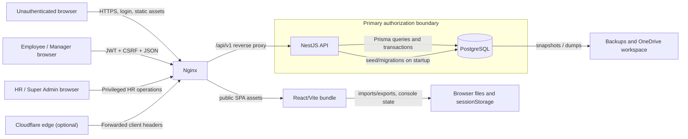

# HR ERP Threat Model

**Revision:** `2e833d0aeff3797341e609c6993aa2b16b284450`

**Status:** Preliminary; based on four completed exhaustive static reviews.

**Scope:** Local repository and local/Docker topology only. No public endpoint or third-party probing was performed.

## System and trust boundaries

The React client is not a security boundary. The API must enforce authentication, role, object ownership, department scope, manager/direct-report scope, soft-delete policy, state transitions, and financial invariants independently of which controls the UI displays.

## Assets

| Asset | Security objective | Consequence of failure |
| --- | --- | --- |
| User credentials, bcrypt hashes, JWT secret, CSRF/session state | Confidentiality and authenticity | Account compromise or forged/replayed sessions. |
| Roles, permissions, employee links, manager hierarchy, `sessionVersion` | Integrity | Privilege escalation, stale session survival, unauthorized access. |
| Employee identity/contact/DOB/address/nationality data | Confidentiality and accuracy | Privacy breach, fraud, employee harm. |
| Salary, payroll, bank/account-derived data, payslips | Confidentiality and integrity | Financial loss, incorrect pay, privacy breach. |
| Attendance and leave balances/requests | Integrity and availability | Incorrect deductions, entitlement loss, payroll corruption. |
| Contracts, reviews, documents, announcements | Confidentiality, ownership, auditability | Cross-user disclosure, altered employment record, false attribution. |
| Whole-console state and backups | Integrity, confidentiality, recoverability | Broad data overwrite/rollback or data exfiltration. |
| PostgreSQL data and migrations | Integrity, durability, availability | Data corruption or outage. |
| Deployment configuration and proxy identity | Authenticity and availability | Rate-limit bypass, unintended public exposure, weak secrets. |

## Actors and capabilities

| Actor | Capabilities |
| --- | --- |
| Unauthenticated network client | Fetch public assets, submit login attempts, control HTTP headers/body/timing, and reach any route exposed by proxy configuration. |
| Employee | Use a valid session, call APIs directly, supply identifiers/query flags/body fields, race requests, import data, and create stored values later viewed/exported by HR. |
| Manager | Employee capabilities plus direct-report workflows, leave decisions, performance-review actions, and announcement creation/update. |
| HR administrator | Broad employee, payroll, leave, state, backup, and account operations; may be affected by malicious stored/exported data. |
| Super administrator | All privileged operations and account administration. |
| Operator/developer | Controls environment variables, containers, migrations, seed execution, tunnel/proxy topology, backups, and source/build inputs. |
| Compromised browser or sync account | Reads session storage or cloud-synced workspace/backup files within the compromised boundary. |

## Entry points

Primary entry points are `POST /api/v1/auth/login`, authenticated controllers under `backend/src/modules`, public frontend assets served by Nginx, browser spreadsheet/image/PDF import/export helpers, whole-console state save/backup/rollback, Prisma seed/migration startup, Docker/Compose environment values, Cloudflare/Nginx forwarded headers, and files stored under the workspace/backups directories.

Public health and login routes are intentional. All other API routes are expected to pass the global `JwtAuthGuard`, `CsrfGuard`, and `RolesGuard` installed in `backend/src/app.module.ts:29-33`. `backend/src/main.ts:9-63` adds proxy trust, 12 MB request limits, production JWT-secret checks, Helmet, CORS, DTO whitelisting, serialization, and production Swagger gating.

## Data flows

1. **Login/session:** browser credentials → public auth controller → rate limiter and bcrypt → JWT containing CSRF/session version → `sessionStorage` → global guards → database-refreshed identity.
2. **Employee/manager object access:** authenticated route and object ID → controller role metadata → service object predicate → Prisma → scoped response/mutation.
3. **Attendance/leave/payroll:** attendance and leave events → leave/attendance tables → payroll generation calculations → payslip and SIF/Excel-compatible exports.
4. **Console state:** privileged browser state → large JSON API payload → optimistic version check → `HrConsoleState` and backup snapshots → later browser rendering/export.
5. **Deployment/bootstrap:** environment secrets → Compose → migrations → seed upserts → API startup. This flow currently crosses the privileged-account lifecycle boundary on every restart.
6. **Backups:** PostgreSQL/console state → local backup/dump → workspace/OneDrive synchronization boundary → operator restore/rollback.

## Security invariants

- Only active, non-deleted users with a current `sessionVersion` may reach protected routes.
- Roles and permissions are necessary but not sufficient; every object read/write must enforce employee, manager, owner, department, visibility, reviewer, or approver scope as applicable.
- Request-controlled fields must never grant role, permission, ownership, reviewer identity, approval state, or audience scope without policy validation.
- Soft-deleted resources must be hidden by default; restoration/audit access must be separately privileged and explicit.
- Leave and payroll values must be derived from authoritative server policy, updated atomically, and protected against duplicate/concurrent transitions.
- Seed/bootstrap code must not alter an existing privileged account during ordinary restart.
- Untrusted strings must remain data across HTML, CSV, XLS-compatible, PDF, URL, and logging contexts.
- Sensitive HR data and password hashes must not be present in public bundles, logs, source control, unencrypted workspaces, or uncontrolled sync locations.
- Proxy-derived identity may be trusted only when the direct peer is a configured trusted proxy that overwrites attacker-provided headers.
- Backups and rollback must be authorized, integrity-checked, encrypted, retained deliberately, and tested on disposable infrastructure.

## Abuse cases and mitigations

| Abuse case | Current mitigation | Gap / residual risk |
| --- | --- | --- |
| Download HR/payroll literals without logging in | Login UI gates rendering | Static bundle is delivered before login; embedded data remains extractable. |
| Disabled privileged account returns after restart | Environment-supplied passwords; normal session revocation exists | Production startup runs seed; upsert restores status/password and does not increment `sessionVersion`. |
| Employee understates leave duration | DTO minimum and date ordering | `totalDays` is not derived from the interval/policy. |
| Concurrent leave requests/decisions corrupt balances | Prisma transactions wrap writes | Checks occur before transactions and writes are unconditional; no lock/version/conditional update closes the race. |
| Manager reads another department's announcement | JWT, role audience, active-date filters | Department membership is absent from read predicate. |
| Manager retargets announcement | Creator ownership check | Ownership does not authorize arbitrary audience/department changes. |
| Manager overwrites HR review | Direct-report check | Existing reviewer/author ownership is not enforced. |
| Ordinary user asks for deleted records | Soft-delete fields and default filtering | Shared `includeDeleted` flag is not privileged across multiple list endpoints. |
| Spreadsheet evaluates employee-controlled cell | CSV quoting and HTML escaping | Formula prefixes are not neutralized for spreadsheet semantics. |
| Attacker rotates forwarded IP | Per-account and per-IP in-memory limits | Nginx trusts `CF-Connecting-IP` by name; exploitability depends on deployment topology. |
| Workspace/sync compromise exposes backup | Git/Docker ignore rules | Plaintext dump is still readable/syncable and includes sensitive HR records and hashes. |

## Existing controls worth preserving

Preserve the global JWT/CSRF/role guard chain, database refresh of JWT principals, session-version revocation, production JWT-secret validation, DTO whitelisting with `forbidNonWhitelisted`, Prisma structured queries, generic login errors, CORS disabled by default, Swagger disabled in production by default, Nginx/Helmet response headers, loopback-only Compose port bindings, health checks, soft-delete fields, and console-state optimistic concurrency. The remediation plan strengthens missing object and transaction controls rather than replacing these working foundations.

## Residual and unverified risks

- Whether `src/data.ts` records represent real staff is unverified; technical public exposure is proven.
- Practical login timing enumeration and forwarded-IP spoofing require measurement in the intended proxy topology.
- Docker image build, service health, migrations against clean/existing databases, and backup restore were not run.
- Browser keyboard/focus/contrast/responsive behavior was not exercised; accessibility and UX scores remain low-confidence.
- The two unfinished discovery reviewers and centralized validation/attack-path phases were stopped at the user's request; this report must not be treated as scan saturation.
